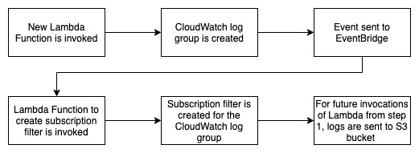

# CDK Project To Automate Cloud Watch Subscription Filter Creation

This is a CDK project to automate creation of cloud watch subscription filters as soon as a log group is created. The subscription filter will enable sending all logs from new log groups to a common S3 bucket.

The project provisions following resources - 
- Invoke-AddLogGroupSub - Event bus rule to call lambda function when a new cloud watch log group is created.
- AddLogGrpSub - Lambda function that will create cloud watch subscription filter.
- AddLogGrpSubRole - Role that provides necessary permissions to the Lambda function.
- firehose_role - Role that provides necessary permissions to firehose to put records into the s3 bucket.
- log_group_role - Role required by subscription filter to put records into firehose.
- logging_firehose - Kinesis Data Firehose delivery stream, to receive logs from CloudWatch log groups and push to S3.
- S3 Bucket  - S3 bucket for firehose to push logs into. 

## Flow 



## Prerequisites
- Install [NodeJS](https://nodejs.org/en/download/)
- Set up AWS CDK as described [here](https://docs.aws.amazon.com/cdk/latest/guide/getting_started.html)
- Get AWS/S3 KMS Key id - 
    - Login to AWS Console.
    - Go to Key Management Service (KMS).
    - In left navigation, click on "AWS managed keys".
    - Note down the key id of aws/s3 key.
- Choose a name for S3 bucket that will be created as part of the stack.

## Steps to run 
- Clone the repository
- Set up environment variables -

    Windows -

    ```
    SET S3_KMS_KEY_ID=<S3_KMS_KEY_ID>
    SET S3_BUCKET_NAME=<S3_BUCKET_NAME>
    ```

    MacBook - 

    ```
    export S3_KMS_KEY_ID=<S3_KMS_KEY_ID>
    export S3_BUCKET_NAME=<S3_BUCKET_NAME>
    ```

- From root folder, run following commands - 
    - `npm run build`
    - `npm run cdk bootstrap`
    - `npm run cdk deploy`

## Verify Resources 

- Login to AWS Console
- Go to CloudFormation
- Search for stack - AutomateCloudWatchSubscriptionFiltersStack
- Go to resources tab. 
- Make sure all resources are created successfully.

## Test

- Create a new Lambda Function or delete CloudWatch log group for an existing Lambda Function
- Execute the Lambda Function.
- Go to CloudWatch and confirm that the new log group is created.
- Click on Subscription filters tab and confirm that a subscription filter has been added to the log group.
- Execute the Lambda function again. 
- Go to S3 bucket and confirm that the logs are exported to that bucket. It may take upto 5 minutes for logs to show up. 

## Log Group Name Format

AddLogGroupSub Lambda function evaluates the log group name against a regular expression to check if it should add subscription filter for that log group or not. This regular expression is saved in environment variable LOG_GROUP_NAME_REGEX. By default, the value of this environment variable is set to `'/aws/lambda/.*'`, which means that only lambda function log groups will be updated. 

To test with different log groups, either update the environment variable in the Lambda function settings, or update following line in lib/lambdas/AddLogGroupSub.ts - 

```
    LOG_GROUP_NAME_REGEX: '/aws/lambda/.*'
```

## References
[AWS CDK](https://docs.aws.amazon.com/cdk/latest/guide/home.html)

[AWS EventBridge](https://docs.aws.amazon.com/eventbridge/latest/userguide/eb-what-is.html) 

[Amazon Kinesis Data Firehose](https://docs.aws.amazon.com/firehose/latest/dev/what-is-this-service.html)

[Using subscription filters](https://docs.aws.amazon.com/AmazonCloudWatch/latest/logs/SubscriptionFilters.html#FirehoseExample)

